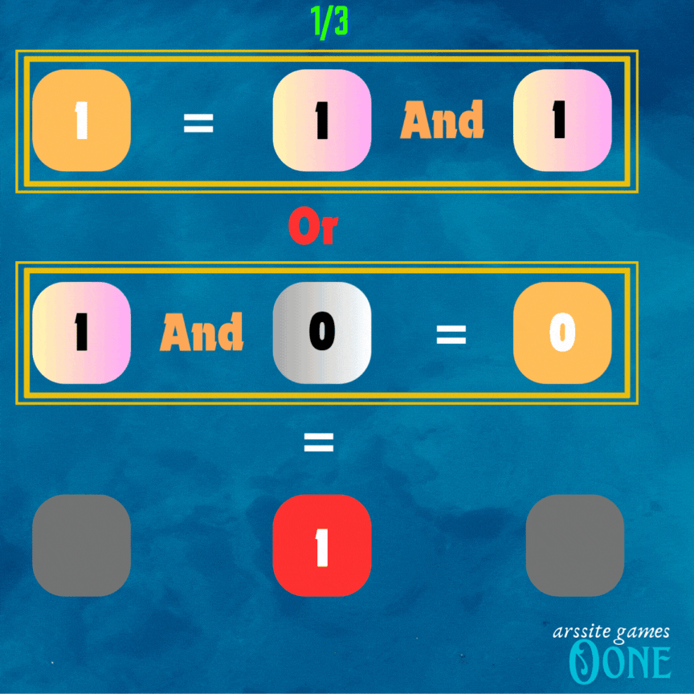

# 0one

Welcome to **0one** – a binary bit game where computation and strategy combine! The game involves 0s and 1s, and your goal is to outwit the ARS Bot to make the majority results 1. 

##   
### Game Rules

1. **Turn Sequence**: You and the ARS Bot take turns alternatively.
   
2. **Starting Bit**: The game starts with Bit 1. You have the first move.

3. **Free Bit Spaces**: 
   - You can use free bit spaces during the 0 bit turn.
   - Free bit spaces do not affect the results directly.

4. **Operations**:
   - **Horizontal Operation**: Perform an AND operation on horizontal pairs of buttons.
   - **Vertical Operation**: Perform an OR operation on vertical pairs of buttons.

5. **Winning Condition**: 
   - You need to make the majority of results 1 to win against the ARS Bot.

### Game Guidelines

1. **Objective**: Beat the ARS Bot by making the majority of results 1.
2. **Bit Use**: 
   - Start with Bit 1.
   - For Bit 0 turns, use free bit space if needed.
3. **Strategy**:
   - Utilize horizontal AND operations and vertical OR operations strategically to achieve your goal.

### Live Game Link

- [Play 0one](https://oonearssite.netlify.app/) <!-- Replace with actual live link -->

### Repository

- [GitHub Repository](https://github.com/arssite/Oone) <!-- Replace with actual GitHub repository link -->

### Connect with Me

- [LinkedIn](https://www.linkedin.com/in/anmol-r-srivastava/) <!-- Replace with actual LinkedIn profile link -->
- [GitHub](https://github.com/arssite) <!-- Replace with actual GitHub profile link -->

